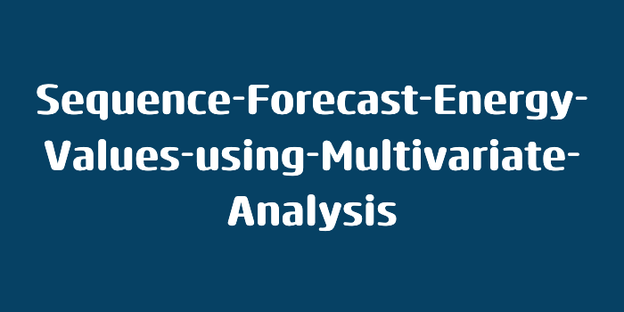

<!-- Improved compatibility of back to top link: See: https://github.com/othneildrew/Best-README-Template/pull/73 -->
<a id="readme-top"></a>
<!--


<!-- PROJECT SHIELDS -->
<!--
*** https://www.markdownguide.org/basic-syntax/#reference-style-links
-->

<!-- PROJECT LOGO -->
<br />
<div align="center">
  <a href="#">
    
  </a>

  <h3 align="center">Two projects using Recurrent Neural Networks (RNN)</h3>
</div>


<!-- TABLE OF CONTENTS -->
<details>
  <summary>Table of Contents</summary>
  <ol>
    <li>
      <a href="#about-the-project">About The Project</a>
      <ul>
        <li><a href="#built-with">Built With</a></li>
      </ul>
    </li>
    <li>
      <a href="#getting-started">Getting Started</a>
      <ul>
        <li><a href="#prerequisites">Prerequisites</a></li>
        <li><a href="#installation">Installation</a></li>
      </ul>
    </li>
    <li><a href="#roadmap">Roadmap</a></li>
    <li><a href="#contributing">Contributing</a></li>
    <li><a href="#license">License</a></li>
    <li><a href="#contact">Contact</a></li>
    <li><a href="#acknowledgments">Acknowledgments</a></li>
  </ol>
</details>


<!-- ABOUT THE PROJECT -->
## About The Project

Short:
* Two models with RNN
* A gated recurrent units and a long short-term memory model
* to predict energy price values with a very small data set

The project tries two different RNN to forecast energy price. Linear regression assumptions (like ARIMA) only consider one factor while forecasting (non-linear univariate models like ARCH, TAR and deep learning models). The energy price is dynamic and dependents on many economic and political factors at the same time. Recurrent Neural Networks (RNN) and its extensions like GRU and LSTM has show in sequential data like sound waves, time series variations and in natural language processing.I try to use RNN namely Gated Recurrent Units (GRU) and Long short-term memory (LSTM) to model. It is proven that deep learning algorithms have the ability to identify existing patterns in the data and exploiting them by using a soft learning process. Unlike other statistical and machine learning algorithms, deep learning architectures are capable to find short term as well as long term dependencies in the data and give good predictions by finding these hidden relationships. The difficulty will be to manage with a very small amount of data.

<p align="right">(<a href="#readme-top">back to top</a>)</p>


### Built With

Following frameworks and tools are used:

* [![Jupyter][Jupyter.org]][Jupyter-url]
* [![TensorFlow][TensorFlow.org]][TensorFlow-url]
* [![Keras][Keras.io]][Keras-url]


<p align="right">(<a href="#readme-top">back to top</a>)</p>


<!-- GETTING STARTED -->
## Getting Started

To get a local copy up and running follow these simple example steps.

### Prerequisites

In addition to python. Install all libaries and jupyter.

### Installation
1. Clone the repo with HTTPS or download the ZIP-file
   ```sh
   https://github.com/MichaelBieri/Sequence-Forecast-Energy-Values-using-Multivariate-Analysis.git
   ```
2. Install pip packages
   ```sh
    pip install tensorflow keras numpy pandas matplotlib seaborn scikit-learn
    pip install jupyter
    ```

<p align="right">(<a href="#readme-top">back to top</a>)</p>

<!-- RLiterature Review -->
## Literature Review
Recurrent Neural Networks (RNN): RNN are a class of ANNs where the output from previous step are fed as input to the current step along with the normal input. In feed forward ANNs, all the inputs and outputs are independent of each other, but in cases like when it is required to predict the time series, the previous values are required and hence there is a need to remember the previous values. RNN suffers from vanishing gradient problem. As the error propagates through the network, it passes through the temporal loop—the hidden layers connected over time by weights. This repeated application causes the gradient to decline rapidly, leading to slower updates for the weights of layers on the far left compared to the far right. This issue, known as the vanishing gradient problem, affects the entire network's training. To address this, Sepp Hochreiter and Jürgen Schmidhuber proposed the Long Short Term Memory (LSTM) network in 1997.
LSTM uses the following gates to solve the problem:
Forget Gate: If set to true, the cell forgets the information coming from previous layers.
Input Gate: Chooses which value from input is going to update the memory state.
Output Gate: Chooses what will be the cell output on the basis of input and memory of the cell.
Gated Recurrent Unit (GRU): It is a variation of RNN introduced by Kyunghyun Cho et al in 2014. It is like a LSTM unit without an output gate. It has fewer parameters than LSTM and have less complexity. GRU have shown better performance than LSTM on certain smaller datasets, but it is still weaker than LSTM overall.

Units: energie in GWh and cent/kWh

Electricity tariffs Electricity prices are composed of:
Grid fee Price for transporting electricity from the power plant to the home. The revenue is used to finance the maintenance and expansion of the electricity grid, for example overhead lines, pylons and transformers. Energy price for the electrical energy supplied. The grid operator either generates this energy with its own power plants or buys it from upstream suppliers. The energy price is also influenced by the type of energy source. A high share of renewable energy (e.g. wind, solar, biomass energy) usually leads to higher energy prices. Municipality taxes Municipal and cantonal taxes and fees. These include, for example, concession fees or local political energy levies. Aidfee Federal tax for the promotion of renewable energies, and the protection of waters and fish. The amount of the aidfee is set annually by the Federal Council. The levy is the same everywhere. These components vary across:
Time products consumption categories energy providers municipalities The place where you live, the consumption category to which you belong, the energy provider you chose, and the product you subscribed for will affect your monthly bills.


<p align="right">(<a href="#readme-top">back to top</a>)</p>


<!-- Methodology -->
## Methodology
# Raw Data (column names):
- swiss_electricity_price excl. VAT average all
- swiss grid usage price
- swiss energy supply costs
- swiss community fees
- swiss feed-in remuneration at cost KEV
- swiss hydropower production
- swiss photovoltaic production
- swiss wind power production
- swiss thermo power production
- swiss nuclear power production
- swiss energy consumption
- europe energy consumption
- swiss inflation
- swiss growth in nominal gross domestic product
- swiss growth in real gross domestic product europe inflation
- global economic policy uncertainty index

# Data Pre-processing
1. A Augmented Dickey-Fuller (ADF) test showed that the time series is not stationary. ARIMA and SARIMAX not possible because of non seasonal data.
2. First, we remove some redundant and noisy data, such as the records with volume 0 and the records that are identical to previous record. For unifying the data range, we applied Min-Max normalization and mapped the values to a range of 0 to 1.
3. The data was split into train, validation and test data. The training data contains records from 1 Jan 1997 to 31 Dec 2006, validation data contains records from 1 Jan 2007 to 31 Dec 2008 and test data contains records from 1 Jan 2009 to 31 Dec 2010.

Testing and Error Calculation:
Each model has been tested on the test set and their Mean Squared Error (MSE), Root Mean Squared Error (RMSE) and R2-score are calculated.

# Parameters
Model 1 - Univariate-LSTM/Multivariate-LSTM
Timesteps: 40
Neurons in each Layer: 40 and 35
Learning Rate: 0.001
Batch Size: 64
Total Trainable Parameters: 17408
The training data is fed to this network and the model is trained for 250 epochs on the training data and validated by the validation data.

Model 2 - Multivariate-GRU
The model is trained on the series of records containing High price (Highest Correlation with target), Volume (Lowest Correlation with target) and Close price of the stock. Different parameters of this ANN are as follows:

Timesteps: 40
Neurons in each Layer: 40 and 35
Learning Rate: 0.0001
Batch Size: 64
Total Trainable Parameters: 13359
The training data is fed to this network and the model is trained for 150 epochs on the training data and validated by the validation data.

<p align="right">(<a href="#readme-top">back to top</a>)</p>

<!-- RESULT -->
## Result
ARIMA and SARIMA are not usable. The GRU models deliver more realistic data.
In case of the small data volume the GRU model is the best solution.

<p align="right">(<a href="#readme-top">back to top</a>)</p>

<!-- LICENSE -->
## License

Distributed under the MIT License. See `LICENSE.txt` for more information.

<p align="right">(<a href="#readme-top">back to top</a>)</p>


<!-- ACKNOWLEDGMENTS -->
## Acknowledgments
My resources:
[1] Basic Median electricity tariff for Switzerland
https://www.strompreis.elcom.admin.ch/
https://www.iea.org/
https://ec.europa.eu/eurostat/web/main/data/database#Data%20navigation%20tree
https://opendata.swiss/de/dataset/energiedashboard-ch-stromproduktion-swissgrid/resource/619e6fa0-7c2b-46dd-9633-7bd60fc5ec16

[2] Energy consumption:
https://pubdb.bfe.admin.ch/de/suche?keywords=400
https://ec.europa.eu/eurostat/databrowser/view/NRG_BAL_C__custom_6200326/bookmark/table?lang=en&bookmarkId=dea184ea-4883-453d-ba24-71e960a4f161
https://www.earthdata.nasa.gov/

[3] Inflation:
https://www.data.finance.admin.ch/superset/dashboard/20/?native_filters_key=6QqyoSKrZy7gnpyEsq_V5Ftd96KRGaCYOz0Q2scksssJShFJDMriUvru48sfIoI1

[4] Global Economic Policy Uncertainty Index:
https://www.policyuncertainty.com/


<p align="right">(<a href="#readme-top">back to top</a>)</p>


<!-- MARKDOWN LINKS & IMAGES -->
<!-- https://www.markdownguide.org/basic-syntax/#reference-style-links -->
[Jupyter.org]: https://img.shields.io/badge/Jupyter-F37626?style=for-the-badge&logo=jupyter&logoColor=white
[Jupyter-url]: https://jupyter.org/
[TensorFlow.org]: https://img.shields.io/badge/TensorFlow-FF6F00?style=for-the-badge&logo=tensorflow&logoColor=white
[TensorFlow-url]: https://www.tensorflow.org/
[Keras.io]: https://img.shields.io/badge/Keras-D00000?style=for-the-badge&logo=keras&logoColor=white
[Keras-url]: https://keras.io/